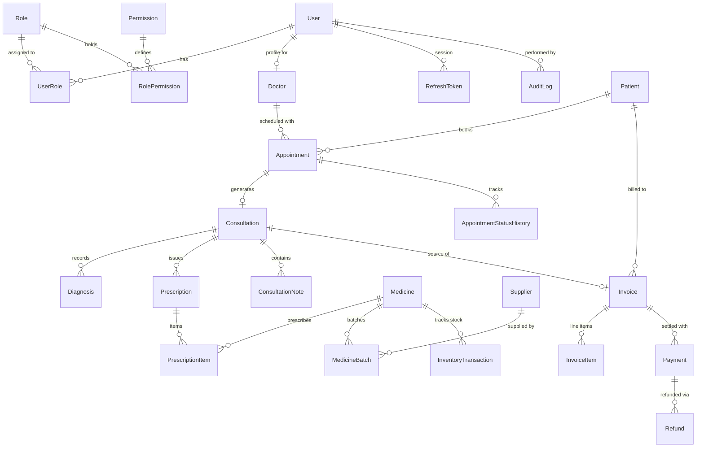

# Ewa Derma Clinic Management System — Database Schema & Architecture Notes

## 1. Overview & Engine

- **Database:** PostgreSQL 16.x
- **ORM:** Prisma v6.x
- **Timezone:** Standardized on `TIMESTAMPTZ` and `Date` types.

---

## 2. Core Architectural Decisions

### Non-Negotiable Rule: Zero Hard Deletes
No table representing clinical records (`patients`, `consultations`, `prescriptions`), financial ledgers (`invoices`, `payments`, `refunds`), or inventory movements (`medicine_batches`, `inventory_transactions`) contains SQL `DELETE` cascades or removal operations.
- Records use `status` enums, `is_active`, `is_void`, `voided_at`, `cancelled_at`, or version tables.

### Prescription Versioning
Prescriptions cannot be updated in-place to overwrite past medical advice.
- When an existing prescription is modified, a new row is created with an incremented `version` number (`version: 2`) and linked via `parent_prescription_id` back to the original prescription.
- The previous prescription is marked `status = SUPERSEDED`.

### Dispensing Decoupled from Prescription
- Creating a prescription generates a medical record and prescription items with `is_dispensed = false`.
- Medicine stock in inventory is **never** deducted when the doctor saves the prescription.
- Stock deduction happens exclusively via the **Dispense** workflow (`InventoryTransactionType.DISPENSED_OUT`), deducting from batches using First-Expiry-First-Out (FEFO).

---

## 3. Entity ID Generation

IDs shown to staff and patients use simple, readable prefixes backed by atomic database sequences in `entity_sequences`:

| Entity | Prefix | Starting Sequence | Example Format | Purpose |
|---|---|---|---|---|
| Patients | `P` | 1000 | `P-1001` | Readable patient code for files and phone lookups |
| Appointments | `A` | 2000 | `A-2001` | Short booking reference |
| Prescriptions | `RX` | 3000 | `RX-3001` | Medical prescription code |
| Invoices | `INV` | 5000 | `INV-5001` | Billing receipt & invoice code |

All IDs are generated strictly server-side by `EntityIdService` inside an atomic transaction.

---

## 4. Tables and Relationship Map

